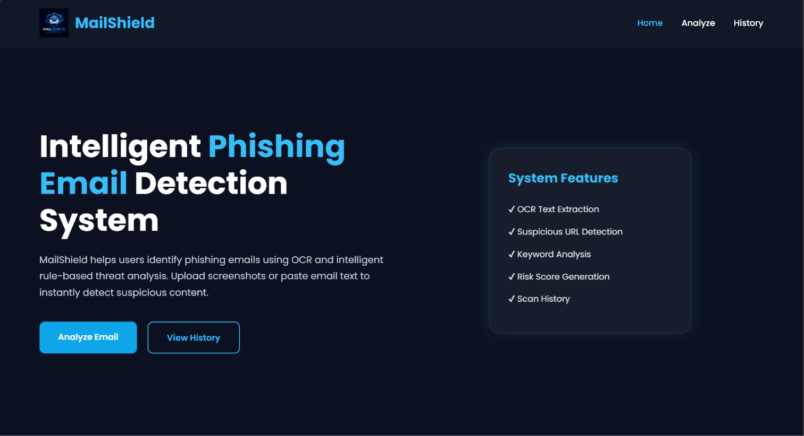
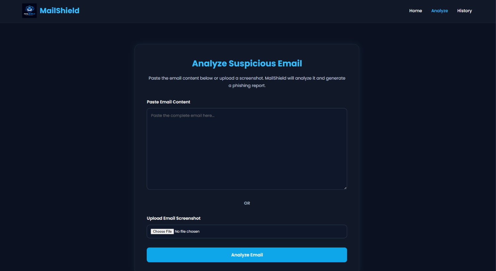
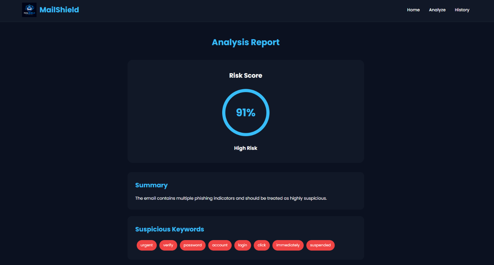
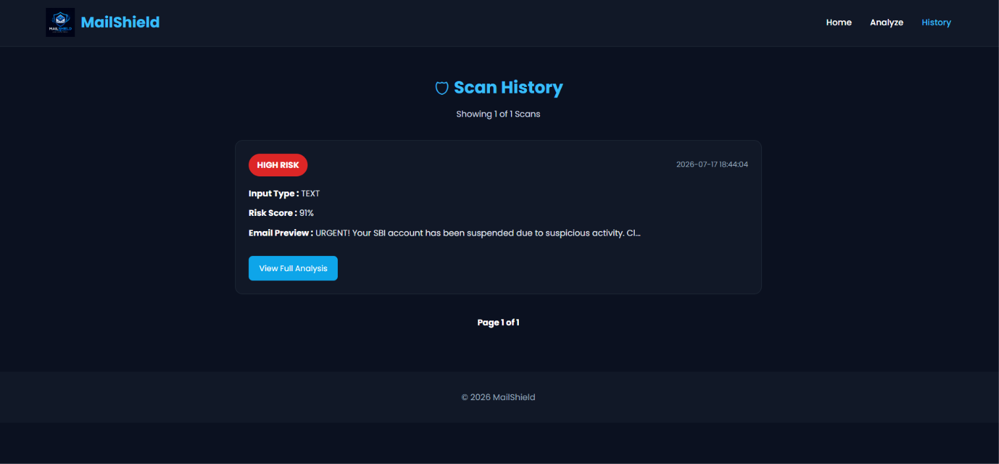

# 🛡️ MailShield

> **A web-based phishing email detection system that leverages OCR and intelligent text analysis to identify suspicious emails and help users recognize potential phishing attempts before interacting with them.**

---

## 📖 Overview

Phishing emails continue to be one of the most prevalent cybersecurity threats, often deceiving users into revealing sensitive information through fake links, urgent messages, or fraudulent requests.

**MailShield** was developed to provide a simple yet effective solution for analyzing suspicious emails. Users can either paste the email content directly or upload a screenshot of an email. The system extracts text from uploaded images using **EasyOCR**, analyzes the content using a Python-based phishing detection engine, assigns a phishing risk score, and classifies the email into different threat levels.

Every analysis is securely stored in a MySQL database, allowing users to review previous scans through a dedicated history dashboard.

---

## ✨ Features

- 📧 Analyze pasted email content
- 🖼️ Upload screenshots for OCR-based analysis
- 🔍 Extract text using EasyOCR
- 📊 Generate phishing risk scores
- 🚨 Classify emails as **Low**, **Medium**, or **High Risk**
- 🔗 Detect suspicious URLs
- ⚠️ Identify phishing-related keywords
- 📜 Maintain complete scan history
- 📄 View expandable detailed analysis reports
- 📑 Paginated history dashboard

---

# 📸 Application Preview

## 🏠 Home Page

<p align="center">

</p>

---

## 🔍 Email Analysis

<p align="center">

</p>

---

## 📊 Detection Result

<p align="center">

</p>

---

## 📜 Scan History

<p align="center">

</p>

---

# 🏗️ System Workflow

```text
                 User
                   │
                   ▼
     Paste Email / Upload Screenshot
                   │
                   ▼
         OCR Extraction (EasyOCR)
                   │
                   ▼
     Python Phishing Analysis Engine
                   │
                   ▼
      Risk Score & Threat Classification
                   │
                   ▼
      Store Results in MySQL Database
                   │
                   ▼
       Display Report & Scan History
```

---

# ⚙️ Technology Stack

| Category | Technology |
|-----------|------------|
| Frontend | HTML5, CSS3 |
| Backend | PHP |
| Database | MySQL |
| OCR | EasyOCR |
| Analysis Engine | Python |
| Server | WAMP Server |

---

# 📂 Project Structure

```text
MailShield
│
├── css/
│   └── style.css
│
├── images/
│   └── logo.png
│
├── python/
│   ├── analyze.py
│   └── ocr.py
│
├── screenshots/
│   ├── home.png
│   ├── analyze.png
│   ├── result.png
│   └── history.png
│
├── uploads/
│
├── index.html
├── analyze.php
├── process.php
├── result.php
├── history.php
├── db.php
├── database.sql
├── .gitignore
└── README.md
```

---

# 🚀 Getting Started

### 1. Clone the repository

```bash
git clone https://github.com/Dharshanashri-2986/MailShield.git
```

### 2. Place the project inside

```text
wamp64/www/
```

### 3. Import the database

Import the provided **database.sql** file using phpMyAdmin.

### 4. Install Python dependency

```bash
pip install easyocr
```

### 5. Start WAMP Server

Start both:

- Apache
- MySQL

### 6. Run the application

Open your browser and visit

```text
http://localhost/mailshield
```

---

# 💡 Project Highlights

- OCR-powered email extraction
- Python integrated with PHP
- Rule-based phishing detection
- Risk score generation
- Secure MySQL storage
- Expandable scan history
- Simple and intuitive interface

---

# 🔮 Future Enhancements

- Machine Learning-based phishing detection
- Email attachment scanning
- PDF report generation
- User authentication
- Dashboard analytics
- Browser extension support

---

# 👨‍💻 Developer

**Dharshanashri S**

B.Tech Computer Science and Engineering

Amrita Vishwa Vidyapeetham

---

## ⭐ Support

If you found this project useful, consider giving it a **Star ⭐** on GitHub.
